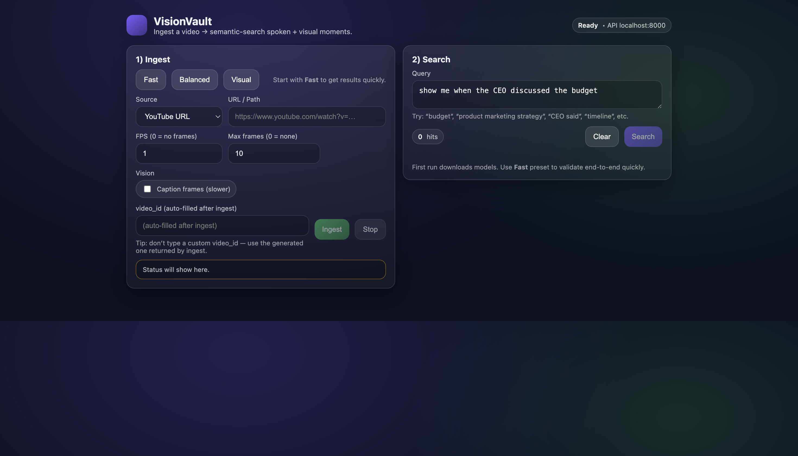

# VisionVault


Open-source **multimodal video search** (Video RAG / moments retrieval).

Ingest a YouTube URL or a local MP4, extract speech + (optional) visual cues, embed chunks, store vectors (FAISS or Qdrant Cloud), and **semantic-search timestamped moments** in a modern web UI.

> Screenshot/GIF: add yours at `assets/ui.png` and update the link below.



## Features

- **Ingest**: YouTube (via `yt-dlp`) or local MP4
- **Extract**: audio + frames (`ffmpeg`)
- **Speech-to-text**: `faster-whisper`
- **Vision (optional)**: frame captioning (BLIP)
- **Retrieval**: Sentence-Transformers embeddings + vector search
  - Default: local FAISS
  - Optional: **Qdrant Cloud** (recommended for low local storage)
- **Quality**: retrieve-more + optional cross-encoder reranking + adaptive filtering to reduce low-confidence hits
- **UX**: React UI with ingest presets, thumbnails, and an embedded **YouTube player** that jumps to retrieved timestamps
- **Ops**: `.env` autoload, `/health/vectorstore`, and best-effort **Stop ingest**

## Project structure

- `app/` – FastAPI routes
- `processing/` – downloader, frame/audio extraction, transcription, chunking
- `embeddings/` – embedding model wrapper + FAISS index
- `vectorstore/` – Qdrant client wrapper
- `retrieval/` – reranking + post-filtering
- `frontend/` – React + Vite UI

## Prerequisites

- Python **3.13** recommended (this repo uses modern deps that may not support very new/very old Python versions)
- Node.js 18+ (for the frontend)
- `ffmpeg` installed and available on PATH

On macOS:

```zsh
brew install ffmpeg
```

## Setup

```zsh
cd /Users/krishruparel/Developer/VisionVault
python -m venv .venv
source .venv/bin/activate
pip install -r requirements.txt
```

## Run

### Backend (FastAPI)

```zsh
cd /Users/krishruparel/Developer/VisionVault
source .venv/bin/activate
uvicorn app.main:app --reload --port 8000
```

Backend will be at: `http://localhost:8000`

### Frontend (React)

```zsh
cd /Users/krishruparel/Developer/VisionVault/frontend
npm install
npm run dev
```

Frontend will be at: `http://localhost:5173`

## Configuration (.env)

This project loads environment variables automatically from `.env` at backend startup.

Create a local `.env` (do **not** commit it):

```env
# Optional: Qdrant Cloud
QDRANT_URL=
QDRANT_API_KEY=
QDRANT_COLLECTION=visionvault_chunks

# Retrieval quality knobs
EMBED_MODEL=BAAI/bge-base-en-v1.5
RERANK_ENABLE=1
RERANK_MODEL=BAAI/bge-reranker-base
RETRIEVE_K=80

# Result filtering (return fewer but more confident hits)
RELATIVE_MIN=0.92
DROPOFF_GAP=0.06
MIN_HIT_SCORE=0
MIN_RETURN_HITS=1
```

Check your vectorstore status:

- `GET /health/vectorstore`

## API

### Ingest

`POST /ingest`

```json
{
  "source_type": "youtube",
  "source": "https://www.youtube.com/watch?v=...",
  "fps": 1.0,
  "max_frames": 10,
  "enable_captions": false
}
```

### Stop ingest (best-effort)

`POST /ingest/cancel`

### Search

`POST /search`

```json
{
  "video_id": "<id from ingest>",
  "query": "show me when they discussed the budget",
  "top_k": 5
}
```

### Thumbnails

- `GET /videos/{video_id}/frames/{frame_file}`

### RAG (retrieval + synthesis)

VisionVault includes an optional RAG endpoint that retrieves top moments and synthesizes an answer using a **local LLM via Ollama**.

`POST /rag/search`

```json
{
  "video_id": "<id from ingest>",
  "query": "what did they decide about the budget?",
  "top_k": 5,
  "llm_model": "llama3.1:8b"
}
```

## Troubleshooting

### YouTube download fails (yt-dlp)

Some videos are restricted or change formats frequently. If a specific URL fails:

- Update `yt-dlp` to latest
- Try a different video to validate the pipeline

### Qdrant “Vector dimension error”

If you switch embedding models (e.g. 384 → 768 dims), Qdrant collections are dimension-specific. This repo namespaces collections by dimension automatically.

### First run is slow

The first run downloads ML models (Whisper / embedding model / reranker). Subsequent runs are much faster.

## Security

- Never commit `.env` (it may contain API keys).
- `.env.example` should contain placeholders only.

## License

MIT — see [`LICENSE`](LICENSE).
